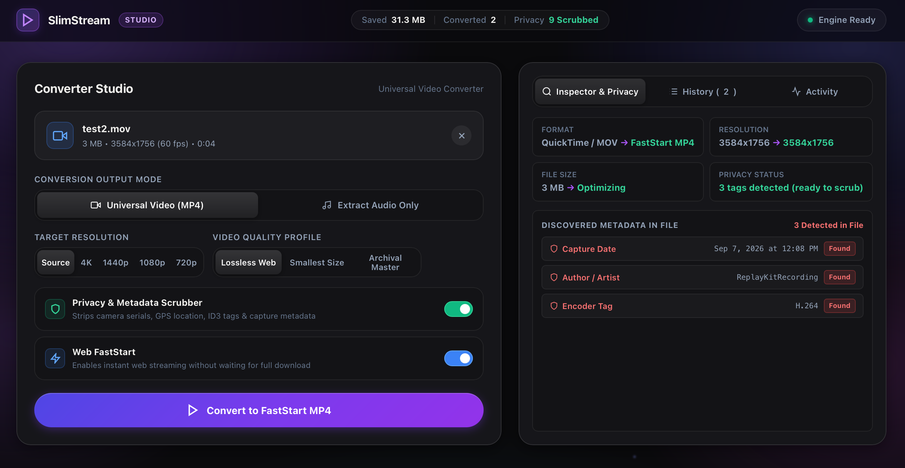
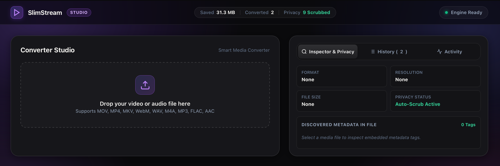
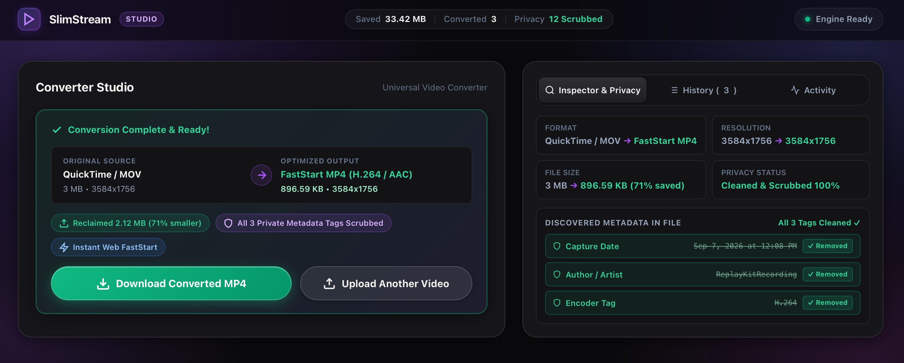

# SlimStream

<p align="center">
  
</p>

A fast, local web app to convert videos and audio files, extract audio streams, and strip tracking metadata using FFmpeg and FFprobe. No cloud uploads, no ads, and no complicated terminal commands.

Designed by [untamedtinker](https://github.com/untamedtinker).

---

## Table of Contents

- [Quick Start](#quick-start)
- [What It Does](#what-it-does)
- [Visual Walkthrough](#visual-walkthrough)
- [Supported Formats](#supported-formats)
- [Requirements](#requirements)
- [Manual Setup](#manual-setup)
- [Tests](#tests)
- [FAQ](#faq)
- [License](#license)

---

## Quick Start

You do not need any coding experience to run SlimStream. Choose either option below:

### Option A: One-Line Terminal Command

1. **Open Terminal**: Press `Cmd + Space`, type **Terminal**, and press `Enter`.
2. **Paste and Run**:
   ```bash
   git clone https://github.com/untamedtinker/slim_stream.git && cd slim_stream && chmod +x start.sh && ./start.sh
   ```

---

### Option B: If You Downloaded the ZIP from GitHub

1. **Unzip the downloaded folder** (e.g. `slim_stream-main`).
2. **Open Terminal in that folder**:
   - Right-click the unzipped folder &rarr; click **New Terminal at Folder** (or open Terminal, type `cd `, drag the folder into Terminal, and press `Enter`).
3. **Run the startup script**:
   ```bash
   chmod +x start.sh && ./start.sh
   ```

---

### What Happens Next
The setup script automatically:
- Checks if you have Node.js, FFmpeg, and FFprobe installed.
- Installs any missing tools or dependencies in the background.
- Starts the local server and automatically opens `http://localhost:3000` in your default browser.
- If your browser does not open automatically, simply open your web browser (Safari, Chrome, Firefox, etc.) and copy & paste this URL into your address bar:
  ```text
  http://localhost:3000
  ```

---

## What It Does

- **Video Conversion**: Convert MOV, MP4, MKV, WebM, and AVI to standard H.264/AAC MP4.
- **Resolution Scaling**: Downscale to 4K (2160p), 1440p (2K), 1080p (Full HD), 720p (HD), or preserve original dimensions.
- **Video Quality Presets**: Lossless Web (CRF 22, 192k AAC), Smallest Size (CRF 26, 128k AAC), or Archival Master (CRF 18, 320k AAC).
- **Audio Extraction**: Pull audio tracks directly from video files into M4A, MP3, FLAC, or WAV without re-encoding video.
- **Audio Conversion**: Transcode standalone WAV, M4A, MP3, FLAC, AAC, OGG, and AIFF files with selectable bitrates (128 kbps to 320 kbps).
- **Privacy Scrubber**: Remove GPS coordinates, device serial numbers, camera models, and timestamps via `-map_metadata -1` and `-fflags +bitexact`.
- **Web FastStart**: Moves the MP4 `moov` atom header to the beginning of the container for instant streaming playback.

---

## Visual Walkthrough

### 1. Drop Media File
Drag in any video or audio file to inspect its codec, resolution, and embedded tags.

<p align="center">
  
</p>

### 2. Choose Settings & Inspect Tags
Select your resolution and quality profile for video, or choose your format and bitrate for audio. The inspector flags discovered metadata in red.

<p align="center">
  
</p>

### 3. Convert & Download
Track real-time progress, verify scrubbed tags, and save your output file to any folder.

<p align="center">
  
</p>

---

## Supported Formats

| Mode | Input Formats | Output Options |
| :--- | :--- | :--- |
| **Video** | `.mov`, `.mp4`, `.mkv`, `.webm`, `.avi`, `.m4v` | MP4 (H.264/AAC), 4K / 1440p / 1080p / 720p, Web FastStart |
| **Audio** | `.wav`, `.m4a`, `.mp3`, `.flac`, `.aac`, `.ogg`, `.aiff` | M4A (`aac`), MP3, FLAC, WAV (128k to 320k bitrates) |
| **Extract** | Any supported video format | M4A, MP3, FLAC, WAV without video encoding overhead |

---

## Requirements

- **Node.js** 18+ (`node -v`)
- **FFmpeg** and **FFprobe**
  - **Automatic Setup (Easiest)**: Running `./start.sh` checks for FFmpeg and installs it automatically.
  - **Using Homebrew**: If you have Homebrew installed, run:
    ```bash
    brew install ffmpeg
    ```
  - **Manual Download from Official Sources**:
    If you do not have Homebrew, you can download static executable binaries directly:
    1. Visit the official [ffmpeg.org download page](https://ffmpeg.org/download.html#build-mac).
    2. Download the **ffmpeg** and **ffprobe** `.zip` packages.
    3. Unzip both files to extract the `ffmpeg` and `ffprobe` executable files.
    4. Create a folder called `bin` inside the `slim_stream` project root and place the two files inside:
       ```text
       slim_stream/
       ├── bin/
       │   ├── ffmpeg
       │   └── ffprobe
       ```
    SlimStream automatically detects binaries in `bin/` whenever the app starts.

---

## Manual Setup

```bash
git clone https://github.com/untamedtinker/slim_stream.git
cd slim_stream
npm install
npm start
```

Open `http://localhost:3000` in your browser.

---

## Tests

Run the automated test suite:
```bash
npm test
```

---

## FAQ

#### Does SlimStream upload my files anywhere?
No. Everything runs 100% locally on your machine using FFmpeg and FFprobe. No data leaves your computer.

#### What metadata gets removed?
GPS locations, camera make and model, device serial numbers, creation timestamps, and author tags (`-map_metadata -1` and `-fflags +bitexact`).

#### Where are outputs saved?
Files are written to the `outputs/` folder in the project directory and can also be downloaded directly from the browser interface.

---

## License

Distributed under the [MIT License](LICENSE). Copyright (c) 2026 [untamedtinker](https://github.com/untamedtinker).
